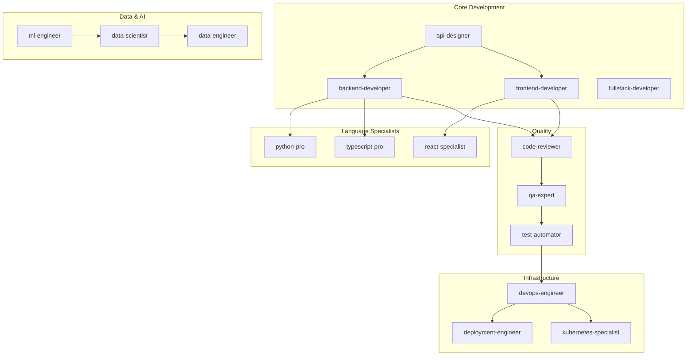

# Agent Capabilities Matrix

> Comprehensive overview of all 115 agents and their capabilities

**Generated**: 2025-12-24
**Total Agents**: 115
**MCP Servers**: 7 unique
**Categories**: 10

---

## Quick Reference

### Agents by Category

| Category | Count | Key Agents |
|----------|-------|------------|
| 01-core-development | 10 | api-designer, backend-developer, frontend-developer |
| 02-language-specialists | 23 | python-pro, typescript-pro, rust-engineer |
| 03-infrastructure | 12 | cloud-architect, devops-engineer, kubernetes-specialist |
| 04-quality-security | 12 | code-reviewer, security-auditor, test-automator |
| 05-data-ai | 12 | ml-engineer, data-scientist, llm-architect |
| 06-developer-experience | 10 | mcp-developer, documentation-engineer, git-workflow-manager |
| 07-specialized-domains | 11 | fintech-engineer, blockchain-developer, game-developer |
| 08-business-product | 11 | product-manager, technical-writer, ux-researcher |
| 09-meta-orchestration | 8 | multi-agent-coordinator, workflow-orchestrator |
| 10-research-analysis | 6 | research-analyst, competitive-analyst, trend-analyst |

---

## MCP Server Coverage Matrix

| Server | 01-Core | 02-Lang | 03-Infra | 04-Quality | 05-Data | 06-DX | 07-Domain | 08-Biz | 09-Meta | 10-Research |
|--------|---------|---------|----------|------------|---------|-------|-----------|--------|---------|-------------|
| filesystem | 10 | 23 | 12 | 12 | 12 | 10 | 11 | 11 | 8 | 6 |
| memory | 10 | 23 | 12 | 12 | 12 | 10 | 11 | 11 | 8 | 6 |
| github | 10 | 23 | 12 | 12 | 12 | 10 | 11 | 11 | 8 | 0 |
| context7 | 8 | 20 | 5 | 2 | 10 | 10 | 6 | 0 | 0 | 0 |
| fetch | 2 | 0 | 0 | 0 | 1 | 0 | 4 | 8 | 0 | 6 |
| postgres | 2 | 5 | 5 | 0 | 8 | 0 | 2 | 0 | 0 | 0 |
| puppeteer | 3 | 2 | 0 | 2 | 0 | 0 | 0 | 0 | 0 | 0 |

---

## API Key Requirements

| API Key | Environment Variable | Agents Requiring | Provider |
|---------|---------------------|------------------|----------|
| GitHub Token | `GITHUB_TOKEN` | ~100 agents | [GitHub](https://github.com/settings/tokens) |
| PostgreSQL | `POSTGRES_URL` | ~22 agents | Local/Cloud |

---

## Detailed Category Breakdown

### 01 - Core Development (10 agents)

| Agent | Primary Domain | MCP Servers | Key Slash Commands |
|-------|----------------|-------------|-------------------|
| api-designer | API Design | filesystem, github, context7, memory, fetch | /api-spec, /endpoint-design |
| backend-developer | Server Development | filesystem, github, context7, memory | /api-build, /db-model |
| electron-pro | Desktop Apps | filesystem, github, context7, memory | /electron-app, /ipc-design |
| frontend-developer | UI Development | filesystem, github, context7, memory, puppeteer | /component, /style |
| fullstack-developer | End-to-End | filesystem, github, context7, memory | /feature, /integrate |
| graphql-architect | GraphQL | filesystem, github, context7, memory | /schema, /resolver |
| microservices-architect | Distributed Systems | filesystem, github, context7, memory | /service, /messaging |
| mobile-developer | Mobile Apps | filesystem, github, context7, memory | /screen, /navigation |
| ui-designer | Visual Design | filesystem, github, memory, puppeteer | /design-system, /prototype |
| websocket-engineer | Real-time | filesystem, github, context7, memory | /socket, /pubsub |

### 02 - Language Specialists (23 agents)

| Agent | Language/Framework | MCP Servers | Key Slash Commands |
|-------|-------------------|-------------|-------------------|
| python-pro | Python 3.11+ | filesystem, github, context7, memory | /py-analyze, /py-test |
| typescript-pro | TypeScript | filesystem, github, context7, memory | /ts-type-check, /ts-refactor |
| javascript-pro | JavaScript ES2023+ | filesystem, github, context7, memory | /js-analyze, /js-debug |
| react-specialist | React 18+ | filesystem, github, context7, memory, puppeteer | /react-component, /react-hooks |
| nextjs-developer | Next.js 14+ | filesystem, github, context7, memory, puppeteer | /nextjs-page, /nextjs-api |
| rust-engineer | Rust | filesystem, github, context7, memory | /rust-analyze, /rust-unsafe-audit |
| golang-pro | Go | filesystem, github, context7, memory | /go-analyze, /go-benchmark |
| java-architect | Java | filesystem, github, context7, memory | /java-analyze, /java-patterns |
| swift-expert | Swift 5.9+ | filesystem, github, context7, memory | /swift-analyze, /swift-concurrency |
| kotlin-specialist | Kotlin | filesystem, github, context7, memory | /kotlin-analyze, /kotlin-coroutines |
| angular-architect | Angular | filesystem, github, context7, memory | /angular-component, /angular-service |
| vue-expert | Vue.js | filesystem, github, context7, memory | /vue-component, /vue-composable |
| django-developer | Django | filesystem, github, context7, memory, postgres | /django-model, /django-view |
| rails-expert | Ruby on Rails | filesystem, github, context7, memory, postgres | /rails-model, /rails-controller |
| laravel-specialist | Laravel | filesystem, github, context7, memory | /laravel-model, /laravel-controller |
| spring-boot-engineer | Spring Boot | filesystem, github, context7, memory | /spring-service, /spring-controller |
| flutter-expert | Flutter | filesystem, github, context7, memory | /flutter-widget, /flutter-state |
| sql-pro | SQL | filesystem, github, postgres, memory | /sql-analyze, /sql-optimize |
| php-pro | PHP 8+ | filesystem, github, context7, memory | /php-analyze, /php-security |
| cpp-pro | C++ | filesystem, github, context7, memory | /cpp-analyze, /cpp-memory-check |
| csharp-developer | C# | filesystem, github, context7, memory | /csharp-analyze, /csharp-async |
| dotnet-core-expert | .NET Core | filesystem, github, context7, memory | /dotnet-service, /dotnet-api |
| dotnet-framework-4.8-expert | .NET 4.8 | filesystem, github, context7, memory | /dotnet48-analyze, /dotnet48-migrate |

### 03 - Infrastructure (12 agents)

| Agent | Primary Domain | MCP Servers | Key Slash Commands |
|-------|----------------|-------------|-------------------|
| cloud-architect | Cloud Design | filesystem, github, context7, memory | /cloud-design, /cost-optimize |
| devops-engineer | DevOps | filesystem, github, context7, memory | /pipeline, /monitor |
| kubernetes-specialist | Kubernetes | filesystem, github, context7, memory | /k8s-deploy, /k8s-scale |
| terraform-engineer | IaC | filesystem, github, context7, memory | /tf-plan, /tf-module |
| deployment-engineer | CI/CD | filesystem, github, memory | /deploy, /rollback |
| platform-engineer | Platform | filesystem, github, memory | /platform-config, /service-mesh |
| security-engineer | Infrastructure Security | filesystem, github, memory | /security-scan, /hardening |
| database-administrator | Database Ops | filesystem, github, postgres, memory | /db-backup, /db-restore |
| network-engineer | Networking | filesystem, github, memory | /network-design, /firewall |
| sre-engineer | Site Reliability | filesystem, github, memory | /sli-slo, /incident-response |
| incident-responder | Incident Mgmt | filesystem, github, memory | /incident-analyze, /postmortem |
| devops-incident-responder | DevOps Incidents | filesystem, github, memory | /incident-triage, /recovery |

### 04 - Quality & Security (12 agents)

| Agent | Primary Domain | MCP Servers | Key Slash Commands |
|-------|----------------|-------------|-------------------|
| code-reviewer | Code Review | filesystem, github, memory | /code-review, /pr-review |
| security-auditor | Security | filesystem, github, memory | /security-audit, /vuln-scan |
| test-automator | Test Automation | filesystem, github, memory | /test-suite, /coverage |
| qa-expert | Quality Assurance | filesystem, github, memory | /qa-plan, /test-strategy |
| performance-engineer | Performance | filesystem, github, memory | /perf-profile, /load-test |
| accessibility-tester | A11y | filesystem, github, memory, puppeteer | /a11y-audit, /wcag-check |
| penetration-tester | Pen Testing | filesystem, github, memory | /pentest, /exploit-check |
| compliance-auditor | Compliance | filesystem, github, memory | /compliance-audit, /gdpr-check |
| architect-reviewer | Architecture | filesystem, github, memory | /arch-review, /design-review |
| chaos-engineer | Resilience | filesystem, github, memory | /chaos-test, /failure-inject |
| debugger | Debugging | filesystem, github, memory | /debug, /trace |
| error-detective | Error Analysis | filesystem, github, memory | /error-analyze, /root-cause |

### 05 - Data & AI (12 agents)

| Agent | Primary Domain | MCP Servers | Key Slash Commands |
|-------|----------------|-------------|-------------------|
| ml-engineer | ML Deployment | filesystem, github, context7, postgres, memory | /ml-train, /ml-deploy |
| data-scientist | Data Science | filesystem, github, context7, postgres, memory | /analyze, /model |
| llm-architect | LLM Systems | filesystem, github, context7, memory | /llm-design, /prompt-optimize |
| data-engineer | Data Pipelines | filesystem, github, context7, postgres, memory | /pipeline, /etl |
| ai-engineer | AI Systems | filesystem, github, context7, memory | /ai-design, /inference |
| database-optimizer | DB Performance | filesystem, github, postgres, memory | /db-optimize, /query-tune |
| postgres-pro | PostgreSQL | filesystem, github, postgres, memory | /pg-analyze, /pg-tune |
| prompt-engineer | Prompting | filesystem, github, memory | /prompt-design, /eval |
| nlp-engineer | NLP | filesystem, github, context7, memory | /nlp-model, /text-process |
| data-analyst | Analysis | filesystem, github, postgres, memory | /data-analyze, /visualize |
| machine-learning-engineer | ML Ops | filesystem, github, context7, postgres, memory | /ml-pipeline, /feature-store |
| mlops-engineer | MLOps | filesystem, github, context7, memory | /mlops-config, /model-registry |

### 06 - Developer Experience (10 agents)

| Agent | Primary Domain | MCP Servers | Key Slash Commands |
|-------|----------------|-------------|-------------------|
| mcp-developer | MCP Development | filesystem, github, context7, memory | /mcp-server, /mcp-tool |
| documentation-engineer | Documentation | filesystem, github, context7, memory | /doc-generate, /api-doc |
| git-workflow-manager | Git Workflows | filesystem, github, memory | /git-flow, /branch-strategy |
| cli-developer | CLI Tools | filesystem, github, context7, memory | /cli-create, /cli-command |
| build-engineer | Build Systems | filesystem, github, context7, memory | /build-config, /bundle |
| dependency-manager | Dependencies | filesystem, github, context7, memory | /deps-audit, /deps-update |
| refactoring-specialist | Refactoring | filesystem, github, context7, memory | /refactor, /extract |
| dx-optimizer | DX | filesystem, github, context7, memory | /dx-audit, /dx-improve |
| legacy-modernizer | Modernization | filesystem, github, context7, memory | /modernize, /migrate |
| tooling-engineer | Dev Tools | filesystem, github, context7, memory | /tool-create, /plugin |

### 07 - Specialized Domains (11 agents)

| Agent | Primary Domain | MCP Servers | Key Slash Commands |
|-------|----------------|-------------|-------------------|
| fintech-engineer | FinTech | filesystem, github, context7, postgres, memory | /fintech-audit, /ledger-design |
| blockchain-developer | Blockchain | filesystem, github, context7, memory | /smart-contract, /contract-audit |
| game-developer | Game Dev | filesystem, github, context7, memory | /game-loop, /physics-optimize |
| payment-integration | Payments | filesystem, github, context7, memory | /payment-flow, /stripe-setup |
| api-documenter | API Docs | filesystem, github, context7, memory, fetch | /api-doc, /openapi-gen |
| seo-specialist | SEO | filesystem, github, memory, fetch | /seo-audit, /keyword-analyze |
| mobile-app-developer | Mobile Apps | filesystem, github, context7, memory | /mobile-screen, /app-store-prep |
| embedded-systems | Embedded | filesystem, github, memory | /firmware-analyze, /driver-create |
| iot-engineer | IoT | filesystem, github, memory | /iot-protocol, /sensor-config |
| quant-analyst | Quantitative | filesystem, github, postgres, memory | /quant-model, /backtest |
| risk-manager | Risk Mgmt | filesystem, github, memory | /risk-assess, /mitigation-plan |

### 08 - Business & Product (11 agents)

| Agent | Primary Domain | MCP Servers | Key Slash Commands |
|-------|----------------|-------------|-------------------|
| product-manager | Product | filesystem, github, memory, fetch | /prd-create, /roadmap |
| project-manager | Projects | filesystem, github, memory | /project-plan, /milestone-track |
| scrum-master | Agile | filesystem, github, memory | /sprint-plan, /retro-facilitate |
| technical-writer | Tech Writing | filesystem, github, memory, fetch | /doc-create, /style-guide |
| business-analyst | Business | filesystem, github, memory, fetch | /requirements, /process-map |
| ux-researcher | UX Research | filesystem, github, memory, fetch | /user-interview, /usability-test |
| legal-advisor | Legal | filesystem, github, memory | /contract-review, /privacy-policy |
| content-marketer | Content | filesystem, github, memory, fetch | /content-plan, /seo-optimize |
| customer-success-manager | CS | filesystem, github, memory | /onboarding-plan, /health-score |
| sales-engineer | Sales Eng | filesystem, github, memory | /demo-prep, /poc-design |
| wordpress-master | WordPress | filesystem, github, context7, memory | /wp-theme, /wp-plugin |

### 09 - Meta & Orchestration (8 agents)

| Agent | Primary Domain | MCP Servers | Key Slash Commands |
|-------|----------------|-------------|-------------------|
| multi-agent-coordinator | Coordination | filesystem, github, memory | /coordinate, /parallel-execute |
| workflow-orchestrator | Workflows | filesystem, github, memory | /workflow-create, /workflow-execute |
| agent-organizer | Organization | filesystem, github, memory | /organize-agents, /team-assemble |
| task-distributor | Distribution | filesystem, github, memory | /distribute, /load-balance |
| context-manager | Context | filesystem, github, memory | /context-save, /context-restore |
| knowledge-synthesizer | Knowledge | filesystem, github, memory | /synthesize, /extract-patterns |
| error-coordinator | Errors | filesystem, github, memory | /error-analyze, /error-recover |
| performance-monitor | Monitoring | filesystem, github, memory | /perf-monitor, /perf-alert |

### 10 - Research & Analysis (6 agents)

| Agent | Primary Domain | MCP Servers | Key Slash Commands |
|-------|----------------|-------------|-------------------|
| research-analyst | Research | filesystem, memory, fetch | /research-plan, /synthesis-report |
| market-researcher | Market | filesystem, memory, fetch | /market-size, /trend-report |
| competitive-analyst | Competition | filesystem, memory, fetch | /competitor-scan, /swot-analysis |
| trend-analyst | Trends | filesystem, memory, fetch | /trend-scan, /forecast |
| data-researcher | Data Research | filesystem, memory, fetch | /data-discover, /insight-report |
| search-specialist | Search | filesystem, memory, fetch | /deep-search, /fact-check |

---

## Agent Collaboration Network

---

## Recommended Agent Combinations

### Full-Stack Web Development
1. **product-manager** - Requirements gathering
2. **api-designer** - API specification
3. **backend-developer** - Server implementation
4. **frontend-developer** - UI implementation
5. **qa-expert** - Testing
6. **devops-engineer** - Deployment

### Data Platform
1. **data-engineer** - Pipeline development
2. **postgres-pro** - Database optimization
3. **data-scientist** - Analysis
4. **mlops-engineer** - ML deployment

### Security Audit
1. **security-auditor** - Security assessment
2. **penetration-tester** - Vulnerability testing
3. **compliance-auditor** - Compliance verification
4. **code-reviewer** - Code security review

### Mobile App Development
1. **product-manager** - Requirements
2. **mobile-developer** - Core development
3. **flutter-expert** or **swift-expert** - Platform-specific
4. **qa-expert** - Testing
5. **mobile-app-developer** - Store deployment

### AI/ML Project
1. **llm-architect** - System design
2. **prompt-engineer** - Prompt development
3. **ml-engineer** - Model training
4. **mlops-engineer** - Deployment
5. **data-engineer** - Data pipelines

---

## Version History

| Date | Changes |
|------|---------|
| 2025-12-24 | Initial matrix structure created |
| 2025-12-24 | All 115 agents transformed and documented |
